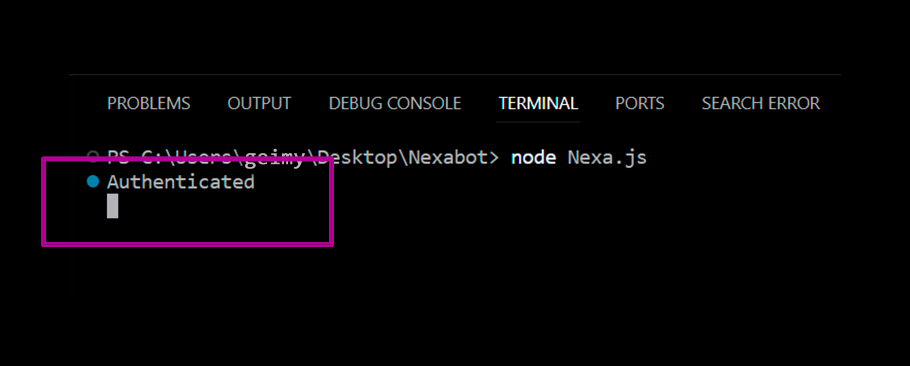
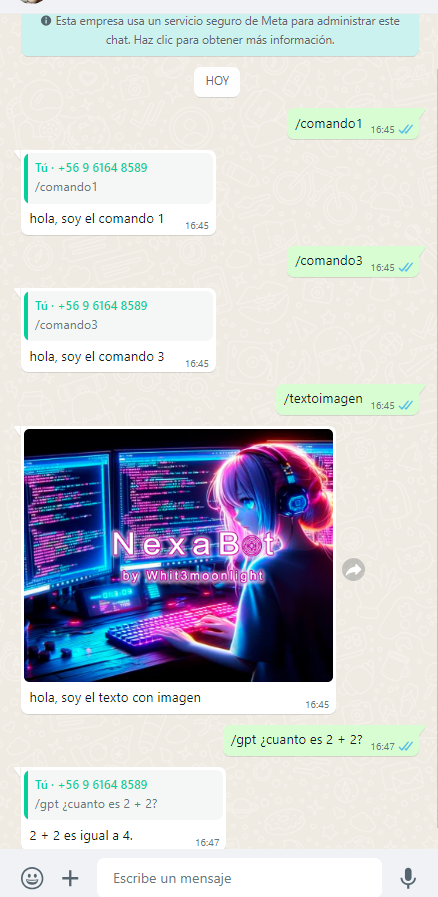

🔴🟡🟢

 

  

  ## Description

  - Nexa un **bot** de respuestas simple, y rapido de implementar.

  - Nexa, a simple response **bot**, quick to implement

   
  

  `Developer and IT enthusiast`
   

  `=========================`
   

  ≽^•⩊•^≼

  ## 📚 &nbsp;Necesario instalar - Installation required

  - npm
  - npm install whatsapp-web.js qrcode-terminal
  - npm install openai
  - npm install axios
  - node Nexa.js -> ejecucion

  ## 📊 &nbsp;Autenticacion
  

    
  

   
  
  ## 📊 &nbsp;Demostracion

  

    
  

  ## 📫 &nbsp;for more information, or assistance My Contacts

  &nbsp;
  &nbsp;
  &nbsp;
  &nbsp;
 

 

             
 
